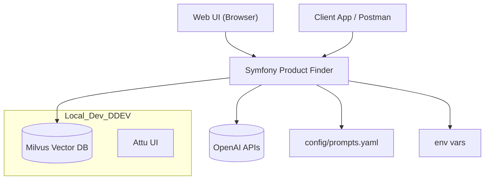

# Projekt-Beschreibung

Diese Anwendung ist ein Symfony‑basierter “Product Finder”, der natürlichsprachliche Produktanfragen versteht, Produktdaten per Embeddings semantisch indiziert und über die Vektordatenbank Milvus wiederfindet. Für Text‑, Bild‑ und Audioeingaben werden OpenAI‑APIs genutzt (Embeddings, Vision, Chat, Whisper). Ein Web‑UI sowie JSON‑APIs stehen bereit.

Belegstellen:
- Ziele/Features im README: `README.md:~1–80`
- Controller-Entry-Points: `src/Controller/ApiSearchController.php:~120, ~170, ~220`, `src/Controller/ProductImportController.php:~40, ~140, ~200`, `src/Controller/EmbeddingController.php:~20, ~40, ~70, ~80`, `src/Controller/WebInterfaceController.php:~25, ~40, ~70`
- Services: `src/Service/OpenAIEmbeddingService.php:~12–40, ~95–170`, `src/Service/OpenAISearchService.php:~12–40, ~60–120`, `src/Service/OpenAISpeechToTextService.php:~12–40, ~55–100`, `src/Service/MilvusVectorStoreService.php:~1–60, ~100–160, ~300–420`
- DI/Wiring + Env: `config/services.yaml:~1–140`
- Prompts: `config/prompts.yaml:~1–30`

Zweck & Business‑Kontext
- Natürlichsprachliche Produktsuche über semantische Ähnlichkeit statt Keyword‑Match.
- Nutzung von Vektoreinbettungen, um Produkte basierend auf Beschreibung, Spezifikationen und Features zu finden.
- Einsatzszenarien: Produktfinder im E‑Commerce, Messen/Demos, interne Katalognavigation.
- Belege: Architektur/Features im `README.md:~1–80`; Search‑Flow und Filterlogik in `src/Controller/ApiSearchController.php:~40–120`, `src/Controller/ProductFinderController.php:~60–140`.

Wichtigste Features
- Import von Produktdaten (XML, JSON) und Vektorisierung:
  - XML/JSON zu Product-Objekten: `src/Service/XmlImportService.php`, `src/Service/JsonImportService.php:~1–120`
  - Embeddings mit OpenAI: `src/Service/OpenAIEmbeddingService.php:~95–170, ~185–230`
  - Upsert in Milvus: `src/Service/MilvusVectorStoreService.php:~180–260`
- Suche per Text, Bild oder Audio:
  - Text: `/api/search/text` → `ApiSearchController::searchText` `src/Controller/ApiSearchController.php:~120–160`
  - Bild: `/api/search/image` → Vision→Embedding→Suche `src/Controller/ApiSearchController.php:~160–220`, `OpenAIEmbeddingService::describeImageFile` `src/Service/OpenAIEmbeddingService.php:~115–170`
  - Audio: `/api/search/audio` → Whisper STT→Suche `src/Controller/ApiSearchController.php:~220–320`, `OpenAISpeechToTextService::transcribe` `src/Service/OpenAISpeechToTextService.php:~55–100`
- Chat‑basierte Empfehlung: `OpenAISearchService::generateChatCompletion` `src/Service/OpenAISearchService.php:~60–120` unter Nutzung der Prompts `config/prompts.yaml:~5–25`.
- Web‑UI mit Cookie‑basiertem API‑Key‑Bridge: `src/Controller/WebInterfaceController.php:~35–55`.

Nicht‑Ziele / Abgrenzungen
- Kein vollständiges E‑Commerce‑Backend (keine Warenkörbe/Checkout, kein Pricing‑Engine‑Workflow).
- Keine Nutzerverwaltung/Rollen; Schutz rein per API‑Key Header/Cookie (`config/services.yaml:~10–40` via `App\EventSubscriber\ApiKeySubscriber` Wiring).
- Keine Produktpflege-/CRUD‑Oberfläche jenseits des Import‑APIs (`src/Controller/ProductImportController.php:~40–190`).
- Milvus/MODEL‑Tuning, Skalierung und Observability sind minimal gehalten (nur Basis‑Logs; `src/Service/*: Logger`‑Nutzung).

High‑Level Systemkontext

- Web‑UI und API‑Clients sprechen mit der Symfony‑App (`src/Controller/*`).
- App nutzt OpenAI für Embeddings, Vision, Chat, STT (`src/Service/OpenAI*Service.php`).
- Vektoren werden in Milvus gespeichert/abgefragt (`src/Service/MilvusVectorStoreService.php`).
- Prompts werden aus YAML geladen (`src/Service/PromptService.php:~35–70`).
- DDEV stellt Milvus/Attu lokal bereit (`.ddev/*`, siehe `AGENTS.md: DDEV`).

How to Reproduce (lokal)
- Voraussetzungen:
  - PHP 8.2+, Composer, DDEV empfohlen (`README.md:~85–140`)
- Schritte:
  1) Dependencies installieren:
     - `ddev composer install` (`README.md:~100–120`)
  2) `.env.local` mit Variablen befüllen (Beispiele, keine Secrets):
     - `OPENAI_API_KEY`, `OPENAI_MODEL=text-embedding-3-small`, `OPENAI_MODEL_IMAGE=gpt-4o`, `OPENAI_CHAT_MODEL=gpt-3.5-turbo`, `APP_API_KEY=<geheim>`, `MILVUS_HOST`, `MILVUS_PORT`, `MILVUS_COLLECTION=products` (`README.md:~120–150`, `config/services.yaml:~60–120`)
  3) DDEV starten:
     - `ddev start` (`README.md:~150–165`)
  4) Produkte importieren:
     - `ddev php bin/console app:import-products src/DataFixtures/xml/sample_products.xml` (`AGENTS.md: Commands`)
     - Importpfad/Parser: `src/Service/XmlImportService.php:~1–120`, Upsert: `src/Service/MilvusVectorStoreService.php:~210–260`
  5) Suche testen:
     - Text: `ddev php bin/console app:test-search "I need a waterproof smartphone"` (`AGENTS.md: Commands`)
     - Web‑UI: `https://symfony-product-finder.ddev.site/` (`README.md:~180–205`, `src/Controller/WebInterfaceController.php:~30–55`)
  6) API‑Key:
     - Alle API‑Endpoints erwarten `X-API-Key` (Wert aus `APP_API_KEY`); Web‑UI setzt `api_key` Cookie (`config/services.yaml:~10–35`, `src/Controller/WebInterfaceController.php:~40–55`).

End‑to‑End Use‑Case (Textsuche)
1) User sendet Text an `/api/search/text` mit `X-API-Key` (`src/Controller/ApiSearchController.php:~120–160`).
2) App erzeugt Query‑Embedding (`EmbeddingGeneratorInterface::generateQueryEmbedding` → `OpenAIEmbeddingService::createTextEmbeddings`) (`src/Service/OpenAIEmbeddingService.php:~185–230, ~60–95`).
3) Milvus‑Suche nach ähnlichen Vektoren (`searchSimilarProducts`) (`src/Service/MilvusVectorStoreService.php:~340–420`).
4) Filterung nach Threshold (Achtung: Vergleichslogik kann divergieren; siehe Hinweis) (`src/Controller/ApiSearchController.php:~70–95`).
5) Prompt‑basierte Empfehlung über Chat‑API (`OpenAISearchService::generateChatCompletion`) (`src/Service/OpenAISearchService.php:~60–120`) mit Promptvorlagen (`config/prompts.yaml:~5–25`).
6) Antwort mit Produktempfehlung und Treffern als JSON (`ChatResponseDto`) (`src/Controller/ApiSearchController.php:~100–120`).

End‑to‑End Use‑Case (Bildsuche)
1) POST `/api/search/image` (multipart `image`) (`src/Controller/ApiSearchController.php:~160–220`).
2) Vision‑Beschreibung erzeugen (`OpenAIEmbeddingService::describeImageFile`) (`src/Service/OpenAIEmbeddingService.php:~115–170`).
3) Beschreibung vektorisieren → Milvus‑Suche → Empfehlung wie oben.

End‑to‑End Use‑Case (Audio)
1) POST `/api/search/audio` (multipart `audio`) (`src/Controller/ApiSearchController.php:~220–320`).
2) Whisper STT transkribiert → Textsuche‑Pfad wie oben (`src/Service/OpenAISpeechToTextService.php:~55–100`).

Wichtige Randbedingungen & Hinweise
- Dimensionskonsistenz: Milvus‑Collection‑Dimension muss dem Embedding‑Modell entsprechen (`OpenAIEmbeddingService::getVectorDimension` `src/Service/OpenAIEmbeddingService.php:~45–70`, Collection‑Init `src/Service/MilvusVectorStoreService.php:~100–160`).
- Threshold-Inkonsistenz: In verschiedenen Komponenten wird `distance <= 0.5` vs. `>= 0.5` verwendet (API vs. Chat Controller) — prüfen/angleichen (Hinweis im `AGENTS.md: Known Pitfalls`; Code: `src/Controller/ProductFinderController.php:~90–110`, `src/Controller/ApiSearchController.php:~70–95`).
- Sicherheit: Nur API‑Key‑Schutz via Header/Cookie; keine Benutzerrollen/Logins (`config/services.yaml:~10–40`, `src/Controller/WebInterfaceController.php:~40–55`).
- Keine Secrets in Doku/Logs; `.env.local` bleibt lokal (`AGENTS.md: Security`).

Offene Fragen / Annahmen
- Metrikinterpretation “distance” vs. “similarity” in Milvus‑Client: final konsistent festzulegen (siehe oben).
- Lizenzangabe: README nennt MIT, composer.json “proprietary” → Abstimmung nötig (`README.md:~200–220`, `composer.json:~1–20`).
- Milvus `dbName` Nutzung: in `searchSimilarProducts()` als `dbName: $this->collectionName` gesetzt (`src/Service/MilvusVectorStoreService.php:~370–400`) — evtl. verifizieren, ob “dbName” wirklich Collection‑Name bedeuten soll.

Onboarding in 30 Minuten (Checkliste)
- System bereit:
  - DDEV installiert, Repo geklont, `ddev start` läuft.
  - `.env.local` mit OpenAI/Milvus/APP_API_KEY gesetzt (Dummy‑Werte ok, echte Keys nur lokal).
  - `ddev composer install` erfolgreich.
- Funktionstest:
  - Sample XML importiert: `ddev php bin/console app:import-products src/DataFixtures/xml/sample_products.xml`.
  - Textsuche per Konsole: `ddev php bin/console app:test-search "waterproof smartphone"`.
  - Web‑UI öffnet sich und lädt API‑Key‑Cookie (`/` Route) (`src/Controller/WebInterfaceController.php:~40–55`).
- API‑Smoke:
  - POST `/api/search/text` mit `{"message":"..."} + X-API-Key`.
  - Prüfen, dass Empfehlung + Treffer zurückkommen.
- Nächste Schritte:
  - Eigene Produkte via `/api/products` einspielen (`src/Controller/ProductImportController.php:~40–150`).
  - Threshold‑Logik in beiden Controllern harmonisieren.
  - Optional: Attu (Milvus UI) öffnen, um Vektoreinträge zu prüfen (siehe `AGENTS.md: Local Development`).

<!-- STEP DONE: 01/13 -->
