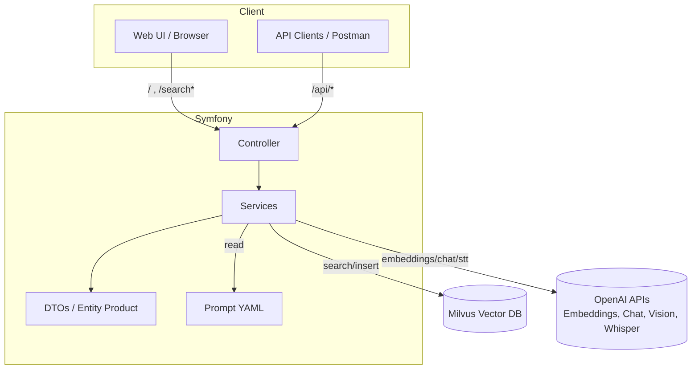
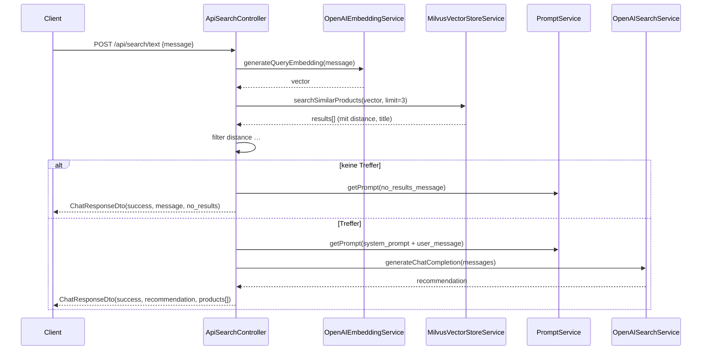
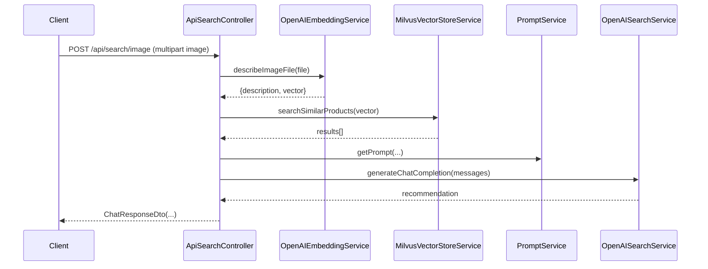
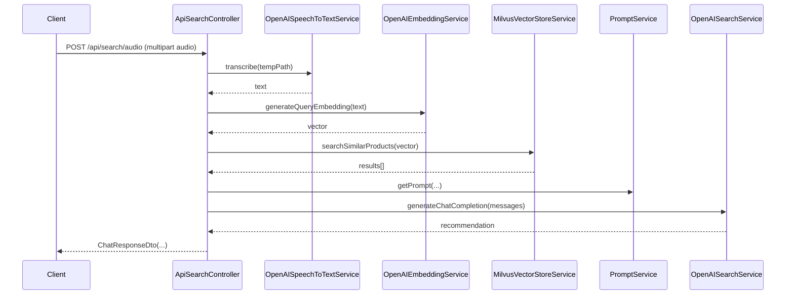
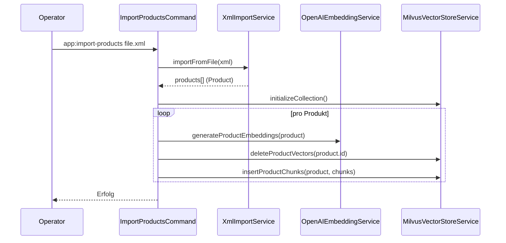

# Systemarchitektur

Diese Sektion beschreibt die Laufzeitarchitektur, Schichten/Module, externe Systeme sowie Sequenzdiagramme der Kern-Use-Cases.

Belegstellen (Auswahl):
- Controller: `src/Controller/ApiSearchController.php:~1–160, ~160–240, ~240–320`, `src/Controller/ProductFinderController.php:~1–160`, `src/Controller/EmbeddingController.php:~1–120`, `src/Controller/ProductImportController.php:~1–220`, `src/Controller/WebInterfaceController.php:~1–220`
- Services: `src/Service/OpenAIEmbeddingService.php:~1–230`, `src/Service/OpenAISearchService.php:~1–140`, `src/Service/OpenAISpeechToTextService.php:~1–120`, `src/Service/MilvusVectorStoreService.php:~1–420`, `src/Service/PromptService.php:~1–100`
- Commands: `src/Command/ImportProductsCommand.php:~1–180`, `src/Command/TestSearchCommand.php:~1–200`, `src/Command/ProcessImageCommand.php:~1–160`, `src/Command/ProcessAudioCommand.php:~1–200`
- Security (API-Key): `src/EventSubscriber/ApiKeySubscriber.php:~1–120`, `config/services.yaml:~14–40`
- DI/Wiring: `config/services.yaml:~1–140`
- Prompts: `config/prompts.yaml:~1–30`

## Laufzeitarchitektur (Überblick)

- HTTP‑Requests treffen in Controller ein und delegieren strikt an Services.
- Kernpfade:
  - Textsuche: Embedding → Milvus‑Search → Filter → Prompt → Chat‑Completion → DTO‑Antwort (`src/Controller/ApiSearchController.php:~120–160`).
  - Bildsuche: Vision‑Beschreibung → Embedding → Milvus‑Search → … (`src/Controller/ApiSearchController.php:~160–220`, `src/Service/OpenAIEmbeddingService.php:~115–170`).
  - Audiosuche: Whisper STT → Embedding → Milvus‑Search → … (`src/Controller/ApiSearchController.php:~220–320`, `src/Service/OpenAISpeechToTextService.php:~55–100`).
  - Produktimport: XML/JSON → Product → Embeddings → Insert/Delete in Milvus (`src/Command/ImportProductsCommand.php:~80–160`, `src/Controller/ProductImportController.php:~40–180`).
- Cross‑cutting Security: API‑Key‑Prüfung über Subscriber (Header `X-API-Key` oder Cookie `api_key`) (`src/EventSubscriber/ApiKeySubscriber.php:~30–80`).

## Schichten & Module

- Presentation (HTTP/UI)
  - Controller: `ApiSearchController`, `EmbeddingController`, `ProductImportController`, `ProductFinderController`, `WebInterfaceController` (`src/Controller/*`).
  - Setzen Cookies (API‑Key) und adaptieren Konsolenbefehle fürs Web (`src/Controller/WebInterfaceController.php:~35–110`).
- Application/Domain Services
  - Embeddings/ Vision: `OpenAIEmbeddingService` (Text‑ und Bildverarbeitung) (`src/Service/OpenAIEmbeddingService.php`).
  - Suchempfehlung (Chat): `OpenAISearchService` (`src/Service/OpenAISearchService.php`).
  - Speech‑to‑Text: `OpenAISpeechToTextService` (`src/Service/OpenAISpeechToTextService.php`).
  - Vector Store: `MilvusVectorStoreService` (Collection‑Init, Insert, Search, Delete) (`src/Service/MilvusVectorStoreService.php`).
  - Prompts: `PromptService` (lädt `config/prompts.yaml`) (`src/Service/PromptService.php`).
  - Import: `XmlImportService`, `JsonImportService` (Parser → `Product`) (`src/Service/*ImportService.php`).
- Domain Model
  - `App\Entity\Product`: reine PHP‑Entity ohne ORM‑Mapping (`src/Entity/Product.php`).
  - DTOs für Requests/Responses in `src/DTO/*` (z. B. `ChatRequestDto`, `ChatResponseDto`, `ProductResponseDto`).
- Infrastruktur
  - DI‑Wiring in `config/services.yaml` bindet Interfaces auf Implementierungen (z. B. `EmbeddingGeneratorInterface` → `OpenAIEmbeddingService`) (`config/services.yaml:~80–120`).
  - Externe Clients: `OpenAI\Client` (Factory), `Milvus\Client` (Factory) (`config/services.yaml:~60–120`).
  - Security via `ApiKeySubscriber` (`src/EventSubscriber/ApiKeySubscriber.php`).

Hinweis: Kein Doctrine‑Repository/ORM aktiv im Pfad; Persistenz der Produkte erfolgt ausschließlich als Vektoreinträge in Milvus.

## Externe Systeme

- Milvus Vector DB
  - Collection‑Management und Ähnlichkeitssuche (`src/Service/MilvusVectorStoreService.php:~90–160, ~340–420`).
  - Dimension muss zum Embedding‑Modell passen (`OpenAIEmbeddingService::getVectorDimension` `src/Service/OpenAIEmbeddingService.php:~45–70`).
- OpenAI APIs
  - Embeddings (Text): `client->embeddings()->create` (`src/Service/OpenAIEmbeddingService.php:~95–140`).
  - Vision (Bildbeschreibung): `client->chat()->create` mit Image‑Content (`src/Service/OpenAIEmbeddingService.php:~120–170`).
  - Chat Completions (Empfehlung): `client->chat()->create` (`src/Service/OpenAISearchService.php:~80–120`).
  - Whisper STT (Audio): `client->audio()->transcribe` (`src/Service/OpenAISpeechToTextService.php:~70–100`).
- Optional/RAG/Responses/Assistants
  - Zusätzliche Services/Controller unter `src/Service/rag/response/*`, `src/Controller/rag/*` (DI in `config/services.yaml:~120–end`).

## Sequenzdiagramme (Kern‑Use‑Cases)

### Textsuche (/api/search/text)

Belegstellen: `src/Controller/ApiSearchController.php:~120–160`, `~60–120`, `src/Service/OpenAIEmbeddingService.php:~185–230`, `src/Service/MilvusVectorStoreService.php:~340–420`, `src/Service/OpenAISearchService.php:~80–120`, `config/prompts.yaml:~5–25`.

### Bildsuche (/api/search/image)

Belegstellen: `src/Controller/ApiSearchController.php:~160–220`, `src/Service/OpenAIEmbeddingService.php:~115–170`.

### Audiosuche (/api/search/audio)

Belegstellen: `src/Controller/ApiSearchController.php:~220–320`, `src/Service/OpenAISpeechToTextService.php:~55–100`.

### Produktimport (XML, Console)

Belegstellen: `src/Command/ImportProductsCommand.php:~80–160`, `src/Service/OpenAIEmbeddingService.php:~170–230`, `src/Service/MilvusVectorStoreService.php:~180–260`.

### Produktimport (Single JSON, HTTP)
- `POST /api/products`:
  - JSON → `JsonImportService::importFromArray` → Product (`src/Controller/ProductImportController.php:~60–100`).
  - `initializeCollection()` → `deleteProductVectors(id)` → `insertProductChunks(product, chunks)` (`src/Controller/ProductImportController.php:~110–160`).
  - Zusätzlich: Upload des Roh‑JSON als Datei zu OpenAI `/files` und Attachment zu Vector Stores (`src/Controller/ProductImportController.php:~160–220`).

## Architekturdetails & Entscheidungen

- Ergebnis‑Filterung/Threshold
  - Unterschiedliche Vergleiche in Code: `distance >= 0.5` vs. `<= 0.5` (API/Command vs. Chat‑Controller). Vereinheitlichung empfohlen. Belege: `src/Controller/ApiSearchController.php:~70–95`, `src/Controller/ProductFinderController.php:~90–110`, `src/Command/TestSearchCommand.php:~70–110`.
  - Hintergrund: COSINE‑Metrik Rückgabewert in Client könnte „Similarity“ statt „Distance“ sein (siehe Hinweis in AGENTS.md).
- Dimensionskonsistenz
  - Collection‑Dimension wird aus Embedding‑Modell abgeleitet (`OpenAIEmbeddingService::getVectorDimension`) und bei Create verwendet (`MilvusVectorStoreService::createCollection`).
- Sicherheit
  - Einheitliche API‑Key‑Prüfung in `ApiKeySubscriber` (Header oder Cookie), Web‑UI setzt Cookie auf `/` (`src/Controller/WebInterfaceController.php:~40–55`).
- Fehlerbehandlung & Logging
  - Services loggen Anfragen/Antworten/Fehler strukturierter (z. B. `openai.embeddings.request/response/error`, `openai.chat.*`, `openai.stt.*`) (`src/Service/*`).

<!-- STEP DONE: 02/13 -->

