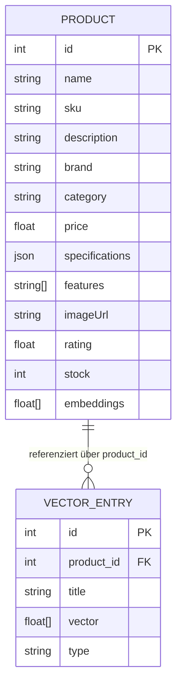

# Datenmodell

Dieses Projekt verwendet kein relationales ORM‑Mapping. Die fachliche Entität Product ist eine einfache PHP‑Klasse; persistiert wird nicht in einer SQL‑Datenbank, sondern als Vektor‑Einträge in Milvus. Such- und Empfehlungslogik arbeiten auf diesen Vektoren.

Belegstellen:
- Entity: `src/Entity/Product.php:~1–220`
- Milvus Collection/Schema/Insert/Search: `src/Service/MilvusVectorStoreService.php:~90–170, ~180–260, ~300–420`
- Embedding-Erzeugung: `src/Service/OpenAIEmbeddingService.php:~170–230`

## Entities (fachlich)

| Entity | Tabelle | Primärschlüssel | Wichtige Felder (Typ, Nullable) | Beziehungen |
|---|---|---|---|---|
| Product | — | id (int, nullable bis gesetzt) | name (string, null), sku (string, null), description (string, null), brand (string, null), category (string, null), price (float, null), specifications (array<string,string>, null), features (array<int,string>, null), imageUrl (string, null), rating (float, null), stock (int, null), embeddings (array<float>, null) | Vektor‑Einträge in Milvus referenzieren `product_id` auf `Product.id` |

Beleg: `src/Entity/Product.php:~15–210` (Getter/Setter der Felder).

Hinweis: Es gibt keine Doctrine‑Annotationen/Attribute und keine Doctrine‑Bundles in `config/bundles.php`, daher keine DB‑Migrationen im klassischen Sinne.

## Milvus Vektor‑Schema (Collection)

Collection wird zur Laufzeit initialisiert. Die Implementierung nutzt die Client‑Methode `collections()->create(...)` mit folgenden Parametern:
- `collectionName`: aus Env `MILVUS_COLLECTION`
- `dimension`: aus Embedding‑Modell (z. B. 1536 bei `text-embedding-ada-002`/`text-embedding-3-small`) (`OpenAIEmbeddingService::getVectorDimension`)
- `metricType`: `COSINE`
- `primaryField`: `id`
- `vectorField`: `vector`
Beleg: `src/Service/MilvusVectorStoreService.php:~112–140`.

Gespeicherte Felder bei Insert:
- Insert aus Produktliste: `title`, `vector`, `type='product'` (`insertProducts`) — `src/Service/MilvusVectorStoreService.php:~140–170`
- Insert pro Chunk: `product_id`, `title`, `vector`, `type` (`insertProductChunks`) — `src/Service/MilvusVectorStoreService.php:~220–260`
- Query/Outputfelder bei Suche: `product_id`, `title`, plus `distance/similarity` je nach Client — `src/Service/MilvusVectorStoreService.php:~360–400`

Anmerkung: Die Collection wird minimal mit `id` und `vector` angelegt; zusätzliche Felder (`product_id`, `title`, `type`) werden als Attribute mitgeschrieben (abhängig vom Milvus‑Client). Prüfen Sie bei Schema‑Härtung, ob explizite Felder/Indexdefinitionen notwendig sind.

## ER‑Diagramm (fachliche Sicht)

Hinweis: `VECTOR_ENTRY` repräsentiert die Milvus‑Collectioneinträge. In der Implementierung ist `id` das primäre Feld der Collection; `product_id` ist das Anwendungs‑FK‑Attribut, das für Löschvorgänge (`deleteProductVectors`) und Output verwendet wird (`searchSimilarProducts`).

## Indizes & Suchparameter

- Metrik: `COSINE` (Ähnlichkeitssuche) (`createCollection`) — `src/Service/MilvusVectorStoreService.php:~120–140`.
- Dimension: abhängig vom Embedding‑Modell (`OpenAIEmbeddingService::getVectorDimension`) — `src/Service/OpenAIEmbeddingService.php:~45–70`.
- Schwellenwert/Filter: in Controllern divergierend verwendet (`distance >= 0.5` vs. `<= 0.5`) — angleichen (siehe `src/Controller/ApiSearchController.php:~70–95`, `src/Controller/ProductFinderController.php:~90–110`, `src/Command/TestSearchCommand.php:~70–110`).

## Migrations‑Strategie

Da kein relationales Schema genutzt wird, gibt es keine Doctrine‑Migrationen. Änderungen am Datenmodell betreffen primär:
- Embedding‑Modell/Dimension: Bei Modellwechsel muss die Milvus‑Collection zur passenden Dimension neu angelegt werden. Vorgehen: ggf. `dropCollection()` → `initializeCollection()` und Einträge neu einspielen (`src/Service/MilvusVectorStoreService.php:~420–500`).
- Zusätzliche Attribute in Milvus: Bei Bedarf Schema in `createCollection` erweitern oder die Client‑Fähigkeiten für dynamische Felder prüfen; Insert‑Payloads sind bereits vorbereitet (`title`, `product_id`, `type`).
- Produktfelder: Erweiterungen am `Product` wirken sich auf die Embedding‑Textaggregation aus (`generateProductEmbeddings`) und erfordern Neu‑Indexierung — `src/Service/OpenAIEmbeddingService.php:~170–230`.

<!-- STEP DONE: 05/13 -->

