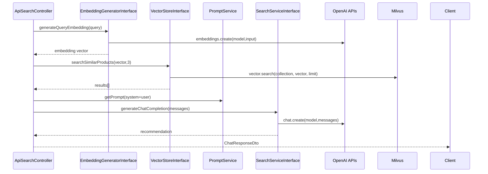
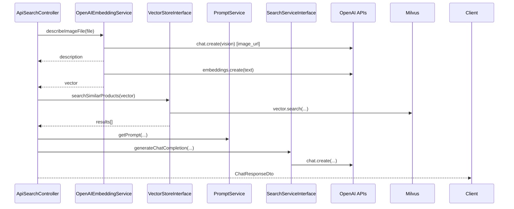
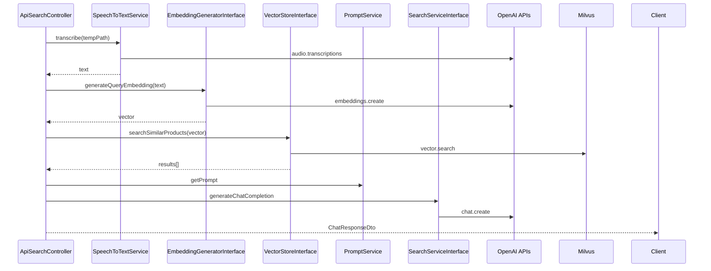
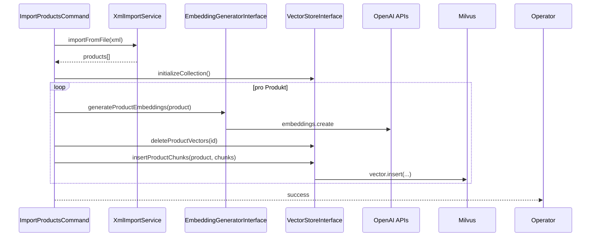
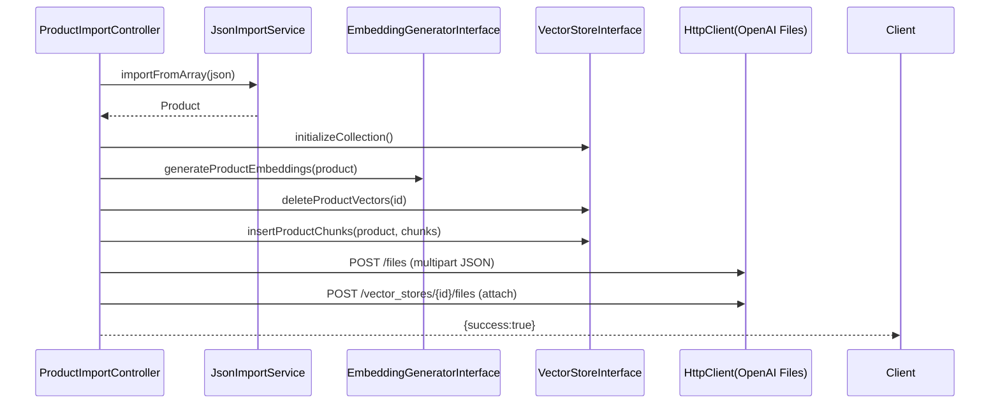

# Domain-Services & Abhängigkeiten

Überblick über zentrale Services, deren Konstruktor-Abhängigkeiten und typische Aufrufketten. Quellen: `docs/_generated/container.txt`, `config/services.yaml`, `src/Service/*`, `src/Controller/*`.

## Wichtige Services (Auszug)

| Service-ID | Klasse | Konstruktor-Args | Scope | Verwendungen (Top 3) |
|---|---|---|---|---|
| `App\Service\OpenAIEmbeddingService` | `App\Service\OpenAIEmbeddingService` | `OpenAI\Client`, `Psr\Log\LoggerInterface`, `string $embeddingModel`, `string $imageModel`, `bool $debugVectors`, `string $imageDescriptionPrompt` (`config/services.yaml:~100–130`) | Container-Singleton | Aufrufer: `ApiSearchController::searchText` (via Interface), `ApiSearchController::searchImage` (Vision), `ImportProductsCommand` (Embeddings) |
| `App\Service\MilvusVectorStoreService` | `App\Service\MilvusVectorStoreService` | `Milvus\Client`, `Psr\Log\LoggerInterface`, `OpenAIEmbeddingService`, `string $collectionName` (`config/services.yaml:~85–110`) | Container-Singleton | Aufrufer: `ApiSearchController`, `ProductFinderController`, `ImportProductsCommand`, `ProductImportController` |
| `App\Service\OpenAISearchService` | `App\Service\OpenAISearchService` | `OpenAI\Client`, `Psr\Log\LoggerInterface`, `string $chatModel` (`config/services.yaml:~130–160`) | Container-Singleton | Aufrufer: `ApiSearchController`, `ProductFinderController`, `TestSearchCommand` |
| `App\Service\OpenAISpeechToTextService` | `App\Service\OpenAISpeechToTextService` | `OpenAI\Client`, `Psr\Log\LoggerInterface`, `string $model` (`config/services.yaml:~160–190`) | Container-Singleton | Aufrufer: `ApiSearchController::searchAudio`, `ProcessAudioCommand` |
| `App\Service\PromptService` | `App\Service\PromptService` | `ParameterBagInterface` (`src/Service/PromptService.php:~20–40`) | Container-Singleton | Aufrufer: `ApiSearchController`, `ProductFinderController`, `TestSearchCommand` |
| `App\Service\JsonImportService` | `App\Service\JsonImportService` | — | Container-Singleton | Aufrufer: `ProductImportController::importProduct` |
| `App\Service\EmbeddingGeneratorInterface` | Alias für `OpenAIEmbeddingService` (`docs/_generated/container.txt:~31–40`) | — | — | Aufrufer: Controller/Commands über Interface |
| `App\Service\SearchServiceInterface` | Alias für `OpenAISearchService` | — | — | Aufrufer: Controller/Commands |
| `App\Service\SpeechToTextServiceInterface` | Alias für `OpenAISpeechToTextService` | — | — | Aufrufer: `ProcessAudioCommand`, `ApiSearchController::searchAudio` |
| `App\Service\VectorStoreInterface` | Alias für `MilvusVectorStoreService` | — | — | Aufrufer: Controller/Commands |

Weitere DI-Factories/Clients:
- `Milvus\Client` via `App\Factory\MilvusClientFactory` (Arguments: `MILVUS_TOKEN`, `MILVUS_HOST`, `MILVUS_PORT`) (`config/services.yaml:~65–90`).
- `OpenAI\Client` via `OpenAI::client($apiKey)` (`config/services.yaml:~140–150`).

## Konstruktor-Abhängigkeiten (aus Code)

- OpenAIEmbeddingService (`src/Service/OpenAIEmbeddingService.php:~20–45`)
  - `Client $client`, `LoggerInterface $logger`, `string $embeddingModel`, `string $imageModel`, `bool $debugVectors`, `string $imageDescriptionPrompt`.
- MilvusVectorStoreService (`src/Service/MilvusVectorStoreService.php:~30–60`)
  - `MilvusClient $milvus`, `LoggerInterface $logger`, `OpenAIEmbeddingService $embeddingService`, `string $collectionName`.
- OpenAISearchService (`src/Service/OpenAISearchService.php:~25–45`)
  - `Client $client`, `LoggerInterface $logger`, `string $chatModel`.
- OpenAISpeechToTextService (`src/Service/OpenAISpeechToTextService.php:~18–30`)
  - `Client $client`, `LoggerInterface $logger`, `string $model`.
- PromptService (`src/Service/PromptService.php:~20–40`)
  - `ParameterBagInterface $parameterBag`.

Bemerkung: `MilvusVectorStoreService` bezieht die Dimension indirekt über `OpenAIEmbeddingService::getVectorDimension()`.

## Sequenzdiagramme

### Textsuche (Controller → Services → Externe Systeme)

### Bildsuche

### Audiosuche

### Import (XML, Console)

### Import (Single JSON, HTTP)

## Lebenszyklus & Scope

- Alle Services sind standardmäßig als Container‑Singletons registriert (`services._defaults.autoconfigure/autowire: true`).
- Zustandslos; Konfiguration über Env‑Variablen (DI) und pro‑Aufruf Daten.
- Externe Ressourcen: `OpenAI\Client` (HTTP), `Milvus\Client` (HTTP/gRPC, je nach Client‑Lib) werden injected und wiederverwendet.

<!-- STEP DONE: 07/13 -->

